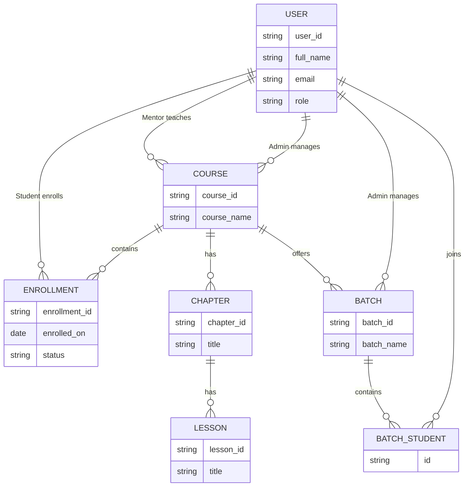

# LUMORA LMS

LUMORA LMS is a modern, enterprise-grade Learning Management System built using a robust, decoupled architecture combining a Vue 3/Vite frontend with a Python-based Frappe backend.

---

# Tech Stack

**Frontend**
- Vue 3
- Vite
- TypeScript
- Pinia (State Management)
- Vanilla CSS / Custom Styling

**Backend**
- Python
- Frappe Framework
- PostgreSQL
- Redis

**DevOps / Infrastructure**
- Docker
- Docker Compose
- Nginx
- VS Code Configurations

---

# Repository Architecture

```text
LUMORA LMS/
├── frontend/             # Vue.js 3 + TypeScript Client App
├── apps/                 # Backend apps (Frappe custom app directory)
│   └── lumora/           # Lumora core Frappe application package
├── docker/               # Docker configurations & Custom Dockerfiles
├── nginx/                # Nginx proxy & static asset configurations
├── docs/                 # Documentation portal
├── scripts/              # Setup, database migration, and dev utilities
├── .github/              # GitHub Action templates & issue config
├── docker-compose.yml    # Main docker compose orchestration configuration
└── README.md             # Project documentation
```

---

# Get Started

## Prerequisites

Ensure the following software is installed:

- Node.js >= 18
- Python >= 3.10
- Docker & Docker Compose
- Git

---

## Local Setup

### 1. Backend Setup

Clone the repository and prepare the backend environment.

```bash
git clone <repo-url>
cd "LUMORA LMS"
```

Set up the backend container or Bench environment as required by the project.

---

### 2. Frontend Setup

Run the Vue 3 development server.

```bash
cd frontend
npm install
npm run dev
```

---

# Local Development Setup

## Repository Structure

This project uses **two directories** during development.

| Directory | Purpose |
|-----------|---------|
| `~/frappe-bench` | Frappe Bench environment used to run the backend (MariaDB, Redis, Bench, LMS site). |
| `LUMORA-LMS/` | Team project repository containing the custom Lumora application and frontend. |

The commands in this guide switch between these directories whenever required.

---

## Overview

This section explains how to configure the local development environment and verify that the application is running correctly.

---

## Development Prerequisites

Ensure the following software is installed.

- Ubuntu (WSL)
- Python
- Node.js
- Yarn
- MariaDB
- Redis
- Bench CLI
- Git

---

## Project Location

Go to the Bench directory.

```bash
cd ~/frappe-bench
```

---

## Verify the Site

```bash
bench --site lumora.localhost list-apps
```

Expected applications:

- frappe
- payments
- lms

---

## Enable Developer Mode

```bash
bench --site lumora.localhost set-config developer_mode 1
```

Verify:

```bash
bench --site lumora.localhost show-config
```

Expected output:

```text
developer_mode    1
```

---

## Configure CORS

The frontend uses a Vite development server.

Configure an explicit origin.

```bash
bench --site lumora.localhost set-config allow_cors http://localhost:8080
```

Verify:

```bash
bench --site lumora.localhost show-config
```

Expected output:

```text
allow_cors    http://localhost:8080
```

> **Note:** Do not use `*` because cookie-based authentication with credentials requires an explicit origin.

---

## Install Frontend Dependencies

```bash
cd frontend
yarn install
```

---

## Start the Frontend

```bash
npm run dev
```

Expected output:

```text
Local: http://localhost:8080
```

---

## Start the Backend

Return to the Bench directory.

```bash
cd ~/frappe-bench
bench start
```

Expected services:

- Redis Cache
- Redis Queue
- Worker
- Scheduler
- SocketIO
- Web Server

---

## Verify Local Site

Open the following URL:

```text
http://127.0.0.1:8000
```

The Frappe login page should load successfully.

---

## Verification Checklist

- [ ] MariaDB running
- [ ] Redis running
- [ ] Site loads on port **8000**
- [ ] Frontend runs on port **8080**
- [ ] Developer mode enabled
- [ ] `allow_cors` configured as `http://localhost:8080`

---

# Core Domain ER Diagram



---

# License

This project is licensed under the MIT License. See the [LICENSE](LICENSE) file for details.